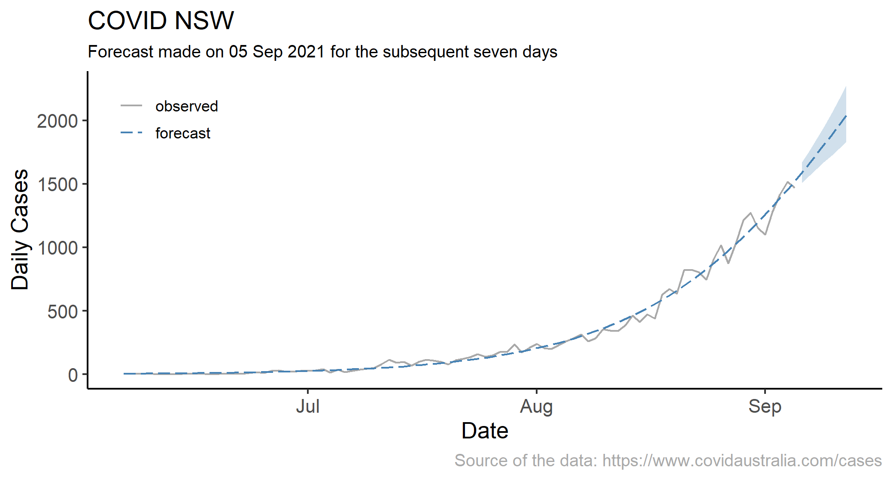
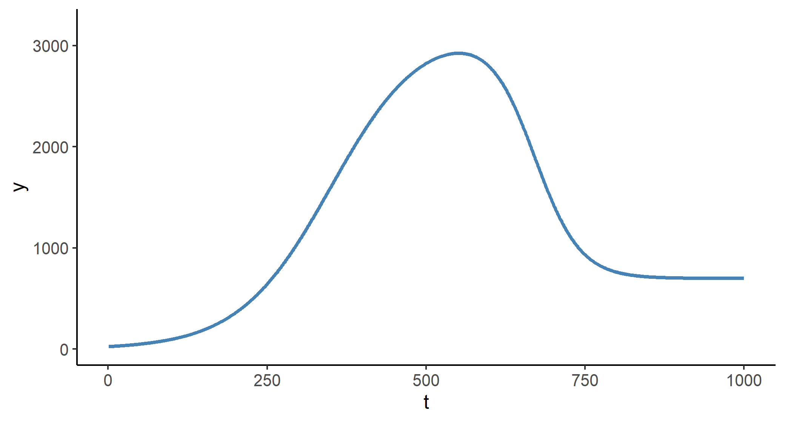

# Forecasting Daily Covid Cases in NSW

I started this project, primarily, to satisfy my curiosity about trends in daily covid cases in NSW during its 2021 wave due to the 'Delta variant,' which resulted in thousands of infections, dozens of deaths despite the multi-week lockdown across the state. 

But there is more to that. With this project, I have combined two important topics of my research and teaching interests. I use a variant of a smooth transition regression to fit the seemingly exponentially trending data to make short term (up to seven-days-ahead) forecasts.

## Current Forecast

## Data and The Model

I use the data on daily cases in NSW, obtained from the [COVID Australia](https://www.covidaustralia.com/) project. I fit these data to a model from a family of regime-dependent regressions - the smooth transition regression. 

A basic version of this model, a two-regime *logistic* smooth transition regression, will fit the data well in the beginning of the 'wave' but not subsequently. Once the daily cases peak, a multiple-regime smooth transition model, or an *exponential* smooth transition regression, which account for turning points in the data, will better approximate the series.

To illustrate, consider a scenario where we start with zero cases in day 0; then the cases increase for the subsequent 500 days or so, and peak at approximately 3000 cases per day; at that point the cases start decreasing and they 'stabilize' after 800 days at approximately 700 cases per day. The fitted trend from a multiple-regime smooth transition model, in such a scenario, will look as it is illustrated in the graph below.

A brief description of the model can be found [here](str.pdf). As outlined in this note, this model offers several benefits:

- In the early stages of the wave, it mimics the exponential trend, which has been a characteristic feature of the covid waves.
- Each regime is a plateau, connected by a sigmoid-shaped function, which gives it an advantage over the exponential trend function when modeling daily covid cases that inevitably cannot increase indefinitely.
- It has a flexibility to add as many regimes as needed, to account for reduction of daily covid cases or, indeed, multiple waves.
- It doesn't restrict the the rates of expansion and contraction (as illustrated in the graph above).

The model has its caveats. The most important of these, arguably shared by nearly all trend models, is that it cannot forecast the turning point with any considerable degree of accuracy, and it can only do so when the turning point is 'around the corner.'  

