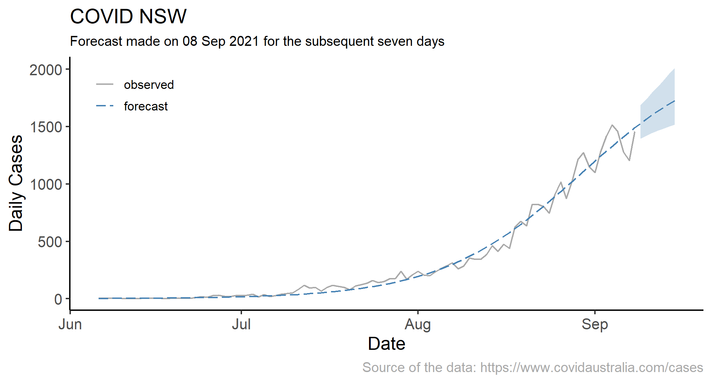

# The NSW Covid Forecasting Project

## Current Forecast

## The Project Motivation

I created this project to primarily satisfy my curiosity about the trends of the covid cases in NSW since its 2021 wave due to the 'Delta variant,' which resulted in thousands of infections, dozens of deaths despite the multi-week lockdown across the state. 

But there is more to that. With this project, I have combined two important topics of my research and teaching interests. I use a variant of a smooth transition regression to fit the seemingly exponentially trending data to make short term (up to seven-days-ahead) forecasts.

## The Data and Model

I use the data on daily cases in NSW, obtained from the [COVID Australia](https://www.covidaustralia.com/) project, which I fit to a model from a family if regime-dependent regressions, the smooth transition regression. 

This model will fit the data well in the beginning of the 'wave' but not subsequently. At some point, a better representation will be the multiple-regime smooth transition model, which will, potentially, allow for turning points in the data.

As an example, consider a scenario where we start with zero cases in day 0; then the cases increase for the subsequent 500 days or so, and peak at approximately 3000 cases per day; at that point the cases start decreasing and they 'stabilize' after 800 days at approximately 700 cases per day. The fitted tend from a multiple-regime smooth transition model, in such a scenario, will look as it is illustrated in the graph below.

A brief introduction to the model can be found [here](str.pdf)

